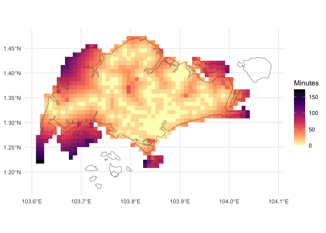
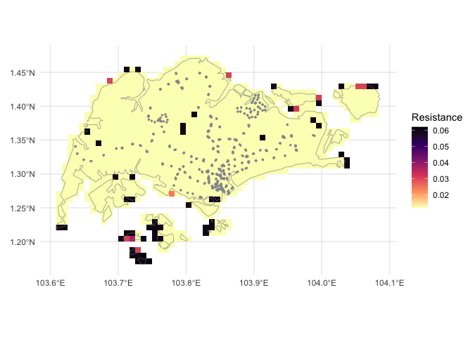

<!-- README.md is generated from README.Rmd. Please edit that file -->

# `traveltime`

<!-- badges: start -->

[](https://idem-lab.r-universe.dev/traveltime)
[](https://github.com/idem-lab/traveltime/actions/workflows/R-CMD-check.yaml)


[](https://app.codecov.io/gh/idem-lab/traveltime)
[](https://lifecycle.r-lib.org/articles/stages.html#stable)
[](code_of_conduct.md)
<!-- badges: end -->

`traveltime` enables a user to create a map of travel time over an area
of interest from a user-specified set of geographic coordinates and
friction surface. The package provides convenient access to global
friction surfaces for walking and motorised travel for the year 2020.
The final result is a raster of the area of interest where the value in
each cell is the lowest travel time in minutes to any of the specified
locations.

<figure>

<figcaption aria-hidden="true">Walking travel time from rail transport
in Singapore</figcaption>
</figure>

## Installation

``` r
install.packages("traveltime", repos = c("https://idem-lab.r-universe.dev"))
```

or

``` r
remotes::install_github("idem-lab/traveltime")
```

## Documentation

### Website

<https://idem-lab.github.io/traveltime/>

### Paper

Ryan, G.E., Tierney, N., Golding, N., and Weiss, D.J (2025).
<a href="https://doi.org/10.31223/X56M74" target="_blank">traveltime: an
R package to calculate travel time across a landscape from
user-specified locations</a>. **EarthArXiv** 10.31223/X56M74

## What does this thing do?

The `traveltime` workflow starts with:

- a set of points you are interested in,

and either

- you supply a friction surface for the area you are interested in, or
- you supply your area of interest and use `get_friction_surface` to
  retrieve a pre-prepared walking or motorised travel friction surface
  from Weiss et al. (2020) [^1] — this will probably be the case in most
  applications.

Then, running `calculate_travel_time` produces a raster as a `terra`
`SpatRaster` with the travel time to the (temporally) nearest of the
supplied points over the area of interest.

### A practical example: walking from public transport in Singapore

Here we will calculate the walking travel time from the nearest mass
transit station across the island nation of Singapore — specifically
Mass Rapid Transit (MRT) and Light Rail Transit (LRT) stations — and
create a map of this.

#### Prepare the data

For this exercise, we need two items of data:

- our points to calculate travel time from — here the locations of
  Singapore’s MRT and LRT stations, and
- our area of interest — in this case a map of Singapore.

##### Points

Our points of interest will be the `stations` data set included in
`traveltime`; a 563 row, 2 column `matrix` containing the longitude
(`x`) and latitude (`y`) of all LRT and MRT station exits in Singapore
from [^2]:

``` r
library(traveltime)
head(stations)
#>             x        y
#> [1,] 103.9091 1.334922
#> [2,] 103.9335 1.336555
#> [3,] 103.8493 1.297699
#> [4,] 103.8508 1.299195
#> [5,] 103.9094 1.335311
#> [6,] 103.9389 1.344999
```

##### Area of interest

To obtain our area of interest, we download a national-level polygon
boundary of Singapore using the `geodata` package. Here we download only
the national boundary (`level = 0`) at a low resolution
(`resolution = 2`). Our boundary `singapore_shapefile` is a `SpatVector`
class object from the package `terra`.

``` r
library(terra)
#> terra 1.8.29
library(geodata)

singapore_shapefile <- gadm(
  country = "Singapore",
  level = 0,
  path = tempdir(),
  resolution = 2
)

singapore_shapefile
#>  class       : SpatVector 
#>  geometry    : polygons 
#>  dimensions  : 1, 2  (geometries, attributes)
#>  extent      : 103.6091, 104.0858, 1.1664, 1.4714  (xmin, xmax, ymin, ymax)
#>  coord. ref. : lon/lat WGS 84 (EPSG:4326) 
#>  names       : GID_0   COUNTRY
#>  type        : <chr>     <chr>
#>  values      :   SGP Singapore
```

##### Friction surface

Now that we have the two items of data that we require initially, the
next step is to prepare a friction surface for our area of interest.

We will use the friction surface from Weiss et al. (2020) that can be
downloaded by `traveltime` with the function `get_friction_surface()`.
This function takes extents in a variety of formats and returns the
surface for that extent only.

We can pass in our basemap `singapore_shapefile`, a `SpatVector`,
directly as the `extent`. We’re interested in walking time from a
station, so we’ll download the walking friction surface by specifying
`surface = "walk2020"`.

(Alternatively, we could use `surface = "motor2020"` for motorised
travel).

We’re only interested in walking *on land*, so we then mask out areas
outside of the land boundary of `singapore_shapefile`:

``` r
friction_singapore <- get_friction_surface(
    surface = "walk2020",
    extent = singapore_shapefile
  )|> 
  mask(singapore_shapefile)
#> Checking if the following Surface-Year combinations are available to download:
#> 
#>     DATASET ID  YEAR
#>   - Accessibility__202001_Global_Walking_Only_Friction_Surface:  DEFAULT
#> 
#> Loading required package: sf
#> Linking to GEOS 3.13.0, GDAL 3.10.0, PROJ 9.5.1; sf_use_s2() is FALSE
#> No encoding supplied: defaulting to UTF-8.
#> <GMLEnvelope>
#> ....|-- lowerCorner: 1.1664 103.6091
#> ....|-- upperCorner: 1.4714 104.0858Start tag expected, '<' not found
```

Thus we have our friction surface as a `SpatRaster`:

``` r
friction_singapore
#> class       : SpatRaster 
#> dimensions  : 37, 57, 1  (nrow, ncol, nlyr)
#> resolution  : 0.008333333, 0.008333333  (x, y)
#> extent      : 103.6083, 104.0833, 1.166667, 1.475  (xmin, xmax, ymin, ymax)
#> coord. ref. : lon/lat WGS 84 (EPSG:4326) 
#> source(s)   : memory
#> varname     : Accessibility__202001_Global_Walking_Only_Friction_Surface_1.1664,103.6091,1.4714,104.0858 
#> name        : friction_surface 
#> min value   :       0.01200000 
#> max value   :       0.06192715
```

##### Input data

Below we plot the friction surface raster `friction_singapore`, with the
vector boundary `singapore_shapefile` as a grey line, and `stations` as
grey points. `traveltime` takes resistance values of friction (see paper
for more details), so higher values of friction indicate more time
travelling across a given cell.

``` r
library(tidyterra)
#> Registered S3 method overwritten by 'tidyterra':
#>   method              from        
#>   autoplot.SpatRaster malariaAtlas
#> 
#> Attaching package: 'tidyterra'
#> The following object is masked from 'package:stats':
#> 
#>     filter
library(ggplot2)

ggplot() +
  geom_spatraster(
    data = friction_singapore
  ) +
  geom_spatvector(
    data = singapore_shapefile,
    fill = "transparent",
    col = "grey50"
  ) +
  geom_point(
    data = stations,
    aes(
      x = x,
      y = y
    ),
    col = "grey60",
    size = 0.5
  ) +
  scale_fill_viridis_c(
    option = "A",
    na.value = "transparent",
    direction = -1
  ) +
  labs(
    fill = "Resistance",
    x = element_blank(),
    y = element_blank()
  ) +
  theme_minimal()
```

<div class="figure">


<p class="caption">
Friction surface raster of Singapore, showing Singapore boundary in
grey, and station locations as grey points.
</p>

</div>

#### Calculate travel time

With all the data collected, the function `calculate_travel_time()`
takes the friction surface `friction_singapore` and the points of
interest in `stations`, and returns a `SpatRaster` of walking time in
minutes to each cell from the nearest station:

``` r
trave_time_singapore <- calculate_travel_time(
  friction_surface = friction_singapore,
  points = stations
)

trave_time_singapore
#> class       : SpatRaster 
#> dimensions  : 37, 57, 1  (nrow, ncol, nlyr)
#> resolution  : 0.008333333, 0.008333333  (x, y)
#> extent      : 103.6083, 104.0833, 1.166667, 1.475  (xmin, xmax, ymin, ymax)
#> coord. ref. :  
#> source(s)   : memory
#> name        : travel_time 
#> min value   :           0 
#> max value   :         Inf
```

##### Plot results

We present the resulting calculated travel times below where (as
expected) the travel times are lowest near station exits and
progressively higher further away. Note that the results in
`trave_time_singapore` include infinite values (`Inf` above). The
islands to the south and north-east are shown as filled cells in the
figure above, i.e., they are not masked out by `singapore_shapefile`.
But because those islands they are not connected to any cells with a
station, the calculated travel time is infinite, and so these cells do
not appear in the figure below.

``` r
ggplot() +
  geom_spatraster(
    data = trave_time_singapore
  ) +
  scale_fill_viridis_c(
    option = "A",
    direction = -1,
    na.value = "transparent"
  ) +
  theme_minimal() +
  labs(fill = "Minutes") +
  geom_spatvector(
    data = singapore_shapefile,
    fill = "transparent",
    col = "grey20"
  )
```

<div class="figure">


<p class="caption">
Map of walking travel time in Singapore, in minutes from nearest MRT or
LRT station.
</p>

</div>

## Code of Conduct

Please note that the `traveltime` project is released with a
[Contributor Code of
Conduct](https://idem-lab.github.io/traveltime/CODE_OF_CONDUCT.html). By
contributing to this project, you agree to abide by its terms.

## Imported data

This repository contains information from the dataset “LTA MRT Station
Exit (GEOJSON)” accessed on the 10th of December 2024 from
[data.gov.sg](https://data.gov.sg/datasets/d_b39d3a0871985372d7e1637193335da5/view),
which is made available under the terms of the Singapore Open Data
Licence version 1.0 <https://data.gov.sg/open-data-licence>

[^1]: D. J. Weiss, A. Nelson, C. A. Vargas-Ruiz, K. Gligoric, S.,
    Bavadekar, E. Gabrilovich, A. Bertozzi-Villa, J. Rozier, H. S.
    Gibson, T., Shekel, C. Kamath, A. Lieber, K. Schulman, Y. Shao, V.
    Qarkaxhija, A. K. Nandi, S. H. Keddie, S. Rumisha, P. Amratia, R.
    Arambepola, E. G. Chestnutt, J. J. Millar, T. L. Symons, E. Cameron,
    K. E. Battle, S. Bhatt, and P. W. Gething. Global maps of travel
    time to healthcare facilities. (2020) Nature Medicine.
    <https://doi.org/10.1038/s41591-020-1059-1>

[^2]: Land Transport Authority. (2019). LTA MRT Station Exit (GEOJSON)
    (2024) \[Dataset\]. data.gov.sg. Retrieved December 10, 2024 from
    <https://data.gov.sg/datasets/d_b39d3a0871985372d7e1637193335da5/view>.
