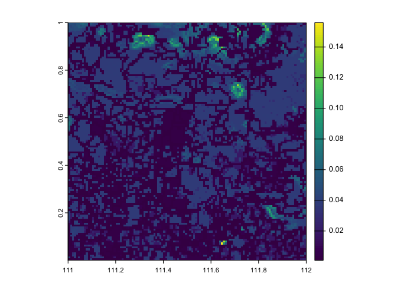
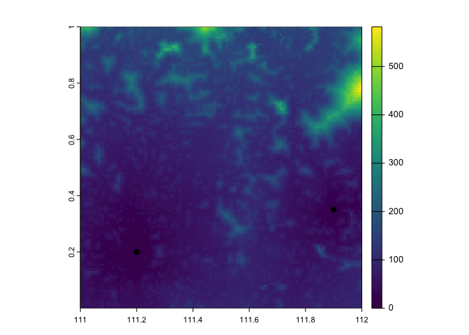
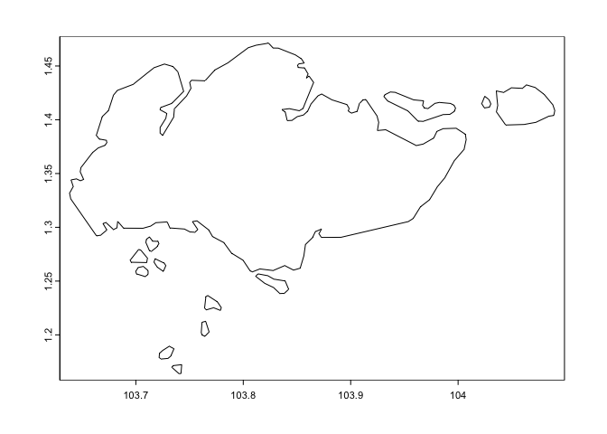
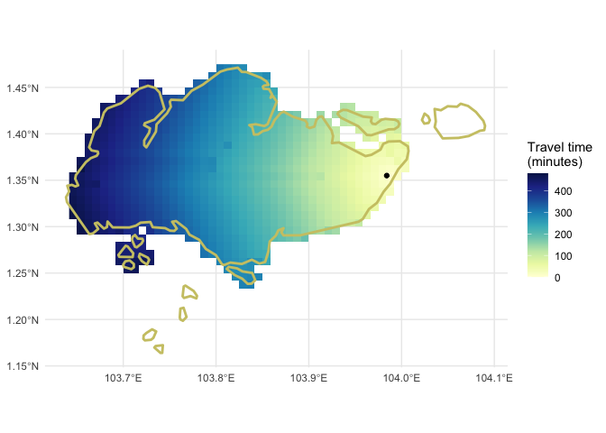

<!-- README.md is generated from README.Rmd. Please edit that file -->

# traveltime


[](https://lifecycle.r-lib.org/articles/stages.html#experimental)


Implements methods from Weiss et al. 2018, 2020 to calculate travel time
from given locations over a friction surface.

Citations:

*D. J. Weiss, A. Nelson, C. A. Vargas-Ruiz, K. Gligoric, S., Bavadekar,
E. Gabrilovich, A. Bertozzi-Villa, J. Rozier, H. S. Gibson, T., Shekel,
C. Kamath, A. Lieber, K. Schulman, Y. Shao, V. Qarkaxhija, A. K. Nandi,
S. H. Keddie, S. Rumisha, P. Amratia, R. Arambepola, E. G. Chestnutt, J.
J. Millar, T. L. Symons, E. Cameron, K. E. Battle, S. Bhatt, and P. W.
Gething.* **Global maps of travel time to healthcare facilities.**
(2020) Nature Medicine. <https://doi.org/10.1038/s41591-020-1059-1>

*D. J. Weiss, A. Nelson, H.S. Gibson, W. Temperley, S. Peedell, A.
Lieber, M. Hancher, E. Poyart, S. Belchior, N. Fullman, B. Mappin, U.
Dalrymple, J. Rozier, T.C.D. Lucas, R.E. Howes, L.S. Tusting, S.Y. Kang,
E. Cameron, D. Bisanzio, K.E. Battle, S. Bhatt, and P.W. Gething.* **A
global map of travel time to cities to assess inequalities in
accessibility in 2015.** (2018). Nature. <doi:10.1038/nature25181>.

## Installation

You can install the development version of traveltime from
[GitHub](https://github.com/) with:

``` r
# install.packages("remotes")
remotes::install_github("idem-lab/traveltime")
```

## Let’s calculate some travel times

First download a friction surface — here using the motorised travel time
from Weiss *et al.* 2020.

``` r
library(traveltime)
library(terra)
#> terra 1.7.71

friction_surface <- get_friction_surface(
    surface = "motor2020",
    extent = matrix(
      data = c("111", "0", "112", 1),
      nrow = 2,
      ncol = 2,
      dimnames = list(
        c("x", "y"),
        c("min", "max")
      )
    )
  )
#> Checking if the following Surface-Year combinations are available to download:
#> 
#>     DATASET ID  YEAR
#>   - Explorer__2020_motorized_friction_surface:  DEFAULT
#> 
#> Loading required package: sf
#> Linking to GEOS 3.11.0, GDAL 3.5.3, PROJ 9.1.0; sf_use_s2() is FALSE
#> <GMLEnvelope>
#> ....|-- lowerCorner: 0 111
#> ....|-- upperCorner: 1 112
friction_surface
#> class       : SpatRaster 
#> dimensions  : 120, 120, 1  (nrow, ncol, nlyr)
#> resolution  : 0.008333333, 0.008333333  (x, y)
#> extent      : 111, 112, 0, 1  (xmin, xmax, ymin, ymax)
#> coord. ref. : lon/lat WGS 84 (EPSG:4326) 
#> source      : Explorer__2020_motorized_friction_surface_0,111,1,112.tif 
#> name        : friction_surface
```

Let’s have a look at that

``` r
plot(friction_surface)
```



Prepare points we would like to calculate travel time from

``` r
from_here <- tibble::tibble(
  x = c(111.2, 111.9),
  y = c(0.2, 0.35)
)
from_here
#> # A tibble: 2 × 2
#>       x     y
#>   <dbl> <dbl>
#> 1  111.  0.2 
#> 2  112.  0.35
```

And calculate the travel time

``` r
travel_time <- calculate_travel_time(
  friction_surface = friction_surface,
  points = from_here
)
travel_time
#> class       : SpatRaster 
#> dimensions  : 120, 120, 1  (nrow, ncol, nlyr)
#> resolution  : 0.008333333, 0.008333333  (x, y)
#> extent      : 111, 112, 0, 1  (xmin, xmax, ymin, ymax)
#> coord. ref. :  
#> source(s)   : memory
#> name        : travel_time 
#> min value   :      0.0000 
#> max value   :    582.1882
```

Et voila!

``` r
plot(travel_time)
points(from_here, pch = 19, add = TRUE)
```



## Let’s go to Singapore

Here it is:

``` r
library(sdmtools)
sin <- sdmtools::make_africa_mask(
  type = "vector",
  countries = "SGP"
)
#> Please Note: Because you did not provide a version, by default the version being used is 202403 (This is the most recent version of admin unit shape data. To see other version options use function listShpVersions)
#> although coordinates are longitude/latitude, st_union assumes that they are
#> planar
plot(sin)
```

 Get
the extent of that `SpatVector` in the format we need it.

``` r
sin_ext <- ext_from_terra(sin)
sin_ext
#>        min      max
#> x 103.6383 104.0900
#> y   1.1640   1.4713
```

We’re going to see how long it takes to walk home from Changi Airport.
So we’ll download the walking-only friction surface this time.

``` r
library(traveltime)
library(terra)

friction_singapore <- get_friction_surface(
    surface = "walk2020",
    extent = sin_ext
  )|> 
  mask(sin)
#> Checking if the following Surface-Year combinations are available to download:
#> 
#>     DATASET ID  YEAR
#>   - Explorer__2020_walking_only_friction_surface:  DEFAULT
#> 
#> <GMLEnvelope>
#> ....|-- lowerCorner: 1.164 103.6383
#> ....|-- upperCorner: 1.4713 104.09

friction_singapore
#> class       : SpatRaster 
#> dimensions  : 37, 54, 1  (nrow, ncol, nlyr)
#> resolution  : 0.008333333, 0.008333333  (x, y)
#> extent      : 103.6417, 104.0917, 1.166667, 1.475  (xmin, xmax, ymin, ymax)
#> coord. ref. : lon/lat WGS 84 (EPSG:4326) 
#> source(s)   : memory
#> varname     : Explorer__2020_walking_only_friction_surface_1.164,103.6383,1.4713,104.09 
#> name        : friction_surface 
#> min value   :       0.01200000 
#> max value   :       0.06192715
```

And where is Changi Airport?

``` r
changi_airport <- tibble::tibble(
  x = c(103.984),
  y = c(1.355)
)
changi_airport
#> # A tibble: 1 × 2
#>       x     y
#>   <dbl> <dbl>
#> 1  104.  1.36
```

Let’s look at those.

``` r
plot(friction_singapore)
plot(sin, add = TRUE)
points(changi_airport, pch = 19, add = TRUE)
```


And calculate the travel time

``` r
travel_time_sin <- calculate_travel_time(
  friction_surface = friction_singapore,
  points = changi_airport
)
travel_time_sin
#> class       : SpatRaster 
#> dimensions  : 37, 54, 1  (nrow, ncol, nlyr)
#> resolution  : 0.008333333, 0.008333333  (x, y)
#> extent      : 103.6417, 104.0917, 1.166667, 1.475  (xmin, xmax, ymin, ymax)
#> coord. ref. :  
#> source(s)   : memory
#> name        : travel_time 
#> min value   :           0 
#> max value   :         Inf
```

Et voi*lah*!

``` r
plot(travel_time_sin)
points(changi_airport, pch = 19, add = TRUE)
plot(sin, add = TRUE)
```


