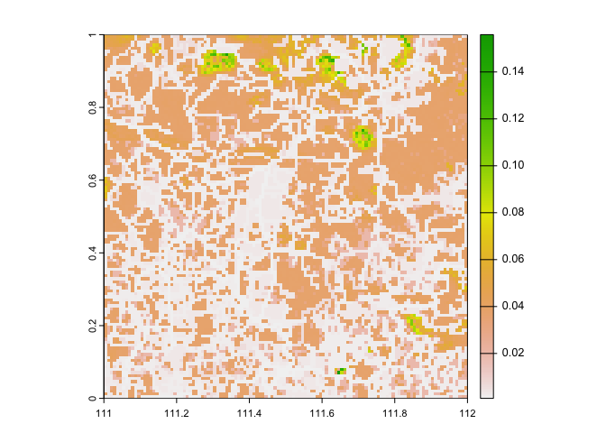

<!-- README.md is generated from README.Rmd. Please edit that file -->

# traveltime


[](https://lifecycle.r-lib.org/articles/stages.html#experimental)


## Installation

You can install the development version of traveltime from
[GitHub](https://github.com/) with:

``` r
# install.packages("remotes")
remotes::install_github("geryan/traveltime")
```

## Example

``` r
library(traveltime)
library(terra)
#> terra 1.7.71
library(sdmtools)

friction_surface <- get_friction_surface(
    surface = "motor2020",
    file_name = temptif(),
    extent = matrix(
      data = c("111", "0", "112", 1),
      nrow = 2,
      ncol = 2,
      dimnames = list(
        c("x", "y"),
        c("min", "max")
      )
    )
  )
#> Checking if the following Surface-Year combinations are available to download:
#> 
#>     DATASET ID  YEAR
#>   - Explorer__2020_motorized_friction_surface:  DEFAULT
#> 
#> Loading required package: sf
#> Linking to GEOS 3.11.0, GDAL 3.5.3, PROJ 9.1.0; sf_use_s2() is FALSE
#> <GMLEnvelope>
#> ....|-- lowerCorner: 0 111
#> ....|-- upperCorner: 1 112

plot(friction_surface)
```


``` r
from_here <- tibble::tibble(
  x = c(111.2, 111.9),
  y = c(0.2, 0.35)
)

travel_time <- calculate_travel_time(
  friction_surface = friction_surface,
  points = from_here,
  file_name = temptif()
)

plot(travel_time)
points(from_here, pch = 19, add = TRUE)
#> Warning in plot.xy(xy.coords(x, y), type = type, ...): "add" is not a graphical
#> parameter
```


