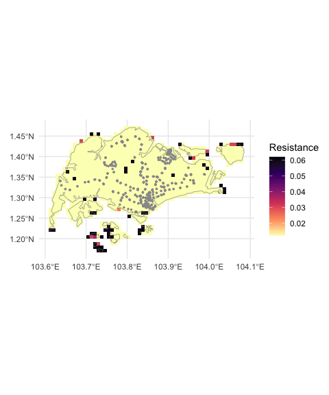
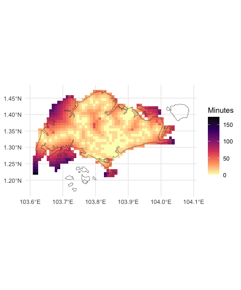

# Summary

Understanding and mapping the time to travel among locations is useful for many activities from urban planning [@zahavi1974traveltime] to public health [@hulland2019travel; @weiss2020global] and myriad others [@nelson2019suite]. Here we present a software package --- `traveltime` --- written in and for the language R [@Rref]. `traveltime` enables a user to create a raster map of the travel time over an area of interest from a user-specified set of locations (geographic coordinates). The result is a raster of the area of interest where the value in each cell is the lowest travel time in minutes to the nearest of the supplied locations. We envisage this software having diverse applications including: estimating sampling bias [@dennis2000bias], allocating defibrillators [@tierney2018novel], setting health districts [@padgham2019introduction], or mapping access to vehicle chargers [@falchetta2021electric] and agricultural facilities [@zhao2023replanting].

The work-flow requires two key steps:

-   preparing a friction surface for the area of interest, and then
-   calculating travel time over that surface for the points of interest.

`traveltime` provides a spatial interface using object classes from the `terra` package [@terra]. Travel time is calculated as movement over a resistance 'friction surface' [@gdistance2017]. To provide easy access to the existing friction surfaces generated by @weiss2020global, `traveltime` internally uses `malariaAtlas` [@pfeffer2018malariaatlas] to download surfaces for the area of interest; though users can also supply any other friction surface.

`traveltime` is available from [R-Universe](https://idem-lab.r-universe.dev/traveltime) and [GitHub](https://github.com/idem-lab/traveltime), and documented at <https://idem-lab.github.io/traveltime/>. Although this article is intended to be the key reference for the `traveltime` package, we suggest citations of the package are accompanied by citing the underlying methodological work as well [@weiss2018global; @weiss2020global].

# Context

Global maps of travel time to cities [@weiss2018global; @nelson2019suite] and health care [@hulland2019travel; @weiss2020global] have generated much interest and use[^1], and the city data set of @nelson2019suite is available to R users through the widely-used `geodata` package [@geodata]. Here we extend that work to enable travel time calculations from any arbitrary set of locations and friction surface.

[^1]: Collectively >1600 citations per Google Scholar at the 28th of January 2025.

A gaggle of R packages provide superficially similar though fundamentally different functionality via the [TravelTime.com](https://www.TravelTime.com) API [@traveltimeapi; @traveltimeR; @rtraveltime; @traveltime_gh]. Their 'Isochron' polygons --- areas reachable within a given time from a given location --- are most comparable to what `traveltime::calculate_travel_time()` calculates. However, each isochron is a single polygon calculated is for a single point location and specified maximum travel time, rather than a raster of temporal gradation across a landscape, jointly for an arbitrary number of points, as in `traveltime`. TravelTime.com cannot provide a single result surface for time to the nearest of a group of points, and continuous time scale without extensive repeated iteration for all combinations of time and points, plus additional calculation of the minimum value for each cell from all points. Furthermore, TravelTime.com requires access keys, a paid subscription beyond a short free period, and caps queries, which add considerable friction to the use of this resource.

With `traveltime`, we provide free and open source software to estimate travel time from any number of user-supplied locations, across a complete area of interest, and with convenient access to motorised transport or walking friction surfaces with global coverage.

# Example: walking from public transport in Singapore

Here we provide a very brief example to calculate and map the walking travel time from rail transport stations across Singapore. [Complete code for this example is available as a vignettte in package documentation](https://idem-lab.github.io/traveltime/articles/singapore.html).

## Prepare data and friction surface

We need two items of data:

-   our area of interest --- Singapore, and
-   our points to calculate travel time from --- Singapore's Mass Rapid Transit (MRT) and Light Rail Transit (LRT) stations.

We download `singapore_shapefile`, a polygon boundary of Singapore from the GADM [@gadm] database using the `geodata` package [@geodata] as our area of interest. Our points are the `traveltime::stations` data, containing coordinates of all LRT and MRT station exits in Singapore [@singdata]. We then download a walking travel friction surface for Singapore:


::: {.cell}

:::

::: {.cell}

:::

::: {.cell}

```{.r .cell-code}
friction_singapore <- traveltime::get_friction_surface(
    surface = "walk2020",
    extent = singapore_shapefile
  )|> 
  terra::mask(singapore_shapefile)
```
:::


(Alternatively, we could use `surface = "motor2020"` for motorised travel. We're also only interested in walking *on land* so we `mask` out areas outside of the land boundary in `singapore_shapefile`)


::: {.cell}

:::


We plot these data below. `traveltime` takes resistance values of friction [@gdistance2017], so higher values of friction indicate more time travelling across a given cell.


::: {.cell}
::: {.cell-output-display}
{#fig-data}
:::
:::


## Calculate and plot the travel time

With all the data collected, the function `calculate_travel_time()` takes the friction surface `friction_singapore` and the points of interest in `stations`, and returns a `SpatRaster` of walking time in minutes to each cell from the nearest station:


::: {.cell}

```{.r .cell-code}
trave_time_singapore <- calculate_travel_time(
  friction_surface = friction_singapore,
  points = stations
)

trave_time_singapore
```

::: {.cell-output .cell-output-stdout}

```
class       : SpatRaster 
dimensions  : 37, 57, 1  (nrow, ncol, nlyr)
resolution  : 0.008333333, 0.008333333  (x, y)
extent      : 103.6083, 104.0833, 1.166667, 1.475  (xmin, xmax, ymin, ymax)
coord. ref. :  
source(s)   : memory
name        : travel_time 
min value   :           0 
max value   :         Inf 
```


:::
:::


We present the resulting calculated travel times in Figure \ref{fig-result} where, as expected, the travel times are lowest near station exits (per Figure \ref{fig-data}) and progressively higher further away. Note that the results in `trave_time_singapore` include infinite values (`Inf` above). In Figure \ref{fig-data}, the islands to the south and north-east are shown as filled cells, but unconnected with the mainland. The raster cells for these islands appear absent in Figure \ref{fig-result}. Because they are not connected to any cells with a station, the calculated travel time is infinite, and so these cells do not appear in Figure \ref{fig-result}.


::: {.cell}
::: {.cell-output-display}
{#fig-result}
:::
:::


# Opportunities for future development

The `traveltime` package is immediately suitable to a range of application. Nonetheless, we see opportunities to build the package utility through:

  - capability to better distribute a wider range friction surfaces, and
  - additional methods to efficiently compute results over large spatial extents.

Firstly, `traveltime` currently facilitates access to walking and motorised friction surfaces for 2020, both at 30 arc-second resolution[^2]. Although the user can presently supply their own friction surface, we expect most applications will use these existing surfaces given the extensive work needed in creating new ones [@weiss2018global; @weiss2020global]. As landscapes are dynamic, it may be useful to incorporate updated versions of these friction surfaces if and when they are available. Furthermore, although the resolution of these data is likely to be suitable for larger landscape foci, higher resolution data may be helpful for more locally focussed analyses. For instance, although the example here was chosen for it's simplicity and low computational demands, a ~1 km^2^ cell size is a relatively large area to walk across, and thus actual waking times may vary significantly within each cell. We underline however that a user can provide their own higher resolution friction surface at present if desired.


[^2]: Approximately 0.008333 decimal degrees, or just below 1 km$^2$ at the equator

# Acknowledgements

This work was supported, in whole or in part, by the Bill & Melinda Gates Foundation [INV-021972]. The conclusions and opinions expressed in this work are those of the authors alone and shall not be attributed to the Foundation. Under the grant conditions of the Foundation, a Creative Commons Attribution 4.0 License has already been assigned to the Author Accepted Manuscript version that might arise from this submission. Please note works submitted as a preprint have not undergone a peer review process.

# References
