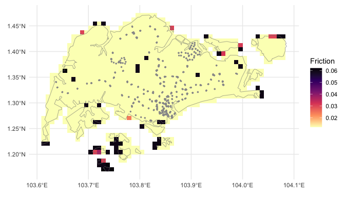
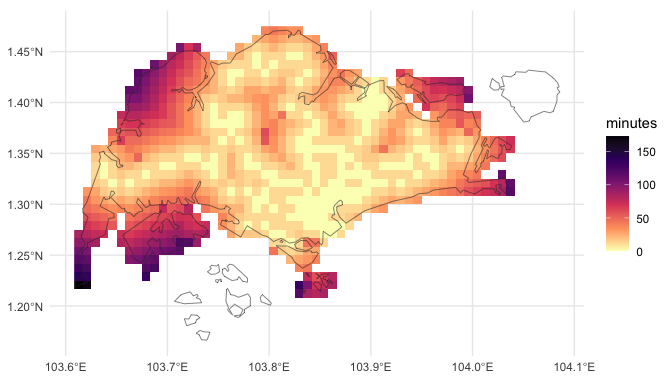

# Summary

Understanding and mapping the time to travel among locations is useful for many activities from urban planning [@zahavi1974traveltime] to public health [@hulland2019travel; @weiss2020global] and myriad others [@nelson2019suite]. Here we present a software package --- `{traveltime}` --- written in and for the language R [@Rref]. `{traveltime}` enables a user to calculate the motorised or walking travel time over an area of interest from a user-specified set of geographic coordinates. The result is a raster of the area of interest, of 30 arcsecond resolution[^1] where the value in each cell is the lowest travel time in minutes to any of the specified locations.

[^1]: Approximately 0.008333 decimal degrees, or just below 1 km$^2$ at the equator

The work-flow requires two steps:

-   downloading a 'friction surface' for the area of interest, and then
-   calculating travel time over that surface for the points of interest.

`{traveltime}` provides a spatial interface using object classes from the `terra` package `[@terra]`. It accepts points as `matrix`, `data.frame`, or `SpatVector` class objects; and the area of interest as an extent in the form of a `numeric`, `SpatExtent`, `SpatVector`, or `SpatRaster` object; and returns the result as a `SpatRaster` object. The package uses `gdistance` [@gdistance2017] to calculate the minimum least-cost-distance for each cell from the points of interest. The travel time is calculated as movement over a 'friction surface' based-on the surfaces generated by @weiss2020global and available from the `malariaAtlas` package [@pfeffer2018malariaatlas]. Rather than house and manipulate these surfaces independently, `{traveltime}` relies internally on `malariaAtlas` to download the surfaces for the area of interest.

`{traveltime}` is available from [R-Universe](https://idem-lab.r-universe.dev/traveltime) and [GitHub](https://github.com/idem-lab/traveltime), and has reference documents at <https://idem-lab.github.io/traveltime/>. Although this article is intended to be the key reference for the `{traveltime}` package, we suggest citations of the package should be accompanied by citing the underlying work [@weiss2018global; @weiss2020global] as well.

# Statement of need

Global maps of travel time to cities [@weiss2018global; @nelson2019suite] and health care facilities [@hulland2019travel; @weiss2020global] have generated significant interest and use[^2], and the city data set of @nelson2019suite is available to R users through the widely-used `geodata` package [@geodata]. There is clear demand for these type of products.

[^2]: Collectively >1600 citations per Google Scholar at the 28th of January 2025.

@weiss2020global made their code available as an R script to allow for reproduction and extension of their analyses (<https://malariaatlas.org/wp-content/uploads/2022/11/R_generic_accessibilty_mapping_script_2020-1.txt> ). To further enable extension of this work, here we have developed an R package based on that code to seamlessly calculate the travel time from any arbitrary set of locations.

Other R packages produce superficially similar though fundamentally different functionality. A gaggle of R packages provide interfaces to the [TravelTime.com](https://www.TravelTime.com) API [@traveltimeapi; @traveltimeR; @rtraveltime; @traveltime_gh]. The TravelTime.com platform provides travel time and routes between pairs of locations, and 'isochron' polygons, which are areas reachable within a given time from a given location. The isochron polygons are most comparable to what the `{traveltime}` package calculates, though each calculation is for a single point location and specified maximum travel time, and the result provides a maximum reachable extent for a specified time, rather than gradation across cells. TravelTime.com cannot provide a single result surface for time to the nearest of a group of points, and continuous time scale without extensive repeated iteration for all combinations of time and points, and additional calculations of the minimum value for each cell from all points. Furthermore, TravelTime.com requires access keys, a paid subscription beyond a short free period, and caps queries, which add considerable friction to the use of this resource.

With `{traveltime}`, we provide free and open source software to estimate motorised or walking travel time from any number of user-supplied locations, across a complete area of interest.

# Example: walking from public transport in Singapore

In this example we wish to calculate the walking travel time from the nearest mass transit station across the island nation of Singapore --- specifically MRT and LRT stations --- and create a map of this.

## Prepare the data and download friction surface

For this excercise, we need two items of data:

-   our area of interest --- in this case a map of Singapore, and
-   our points to calculate travel time from --- here the locations of Singapore's MRT and LRT stations.

We can download a national-level polygon of Singapore from the GADM [@gadm] database using the `geodata` package [@geodata]. Here we download only the national boundary (`level = 0`) and at a low resolution (`resolution = 2`). Our boundary `sin` is a `SpatVector` class object.


::: {.cell}

```{.r .cell-code}
library(terra)
library(geodata)

sin <- gadm(
  country = "Singapore",
  level = 0,
  path = tempdir(),
  resolution = 2
)

sin
```

::: {.cell-output .cell-output-stdout}

```
 class       : SpatVector 
 geometry    : polygons 
 dimensions  : 1, 2  (geometries, attributes)
 extent      : 103.6091, 104.0858, 1.1664, 1.4714  (xmin, xmax, ymin, ymax)
 coord. ref. : lon/lat WGS 84 (EPSG:4326) 
 names       : GID_0   COUNTRY
 type        : <chr>     <chr>
 values      :   SGP Singapore
```


:::
:::


The the `stations` data set included in the `{traveltime}` package is a 563 row, 2 column `matrix` containing the longitude (`x`) and latitude (`y`) of all LRT and MRT station exits in Singapore from @singdata.


::: {.cell}

```{.r .cell-code}
library(traveltime)
head(stations)
```

::: {.cell-output .cell-output-stdout}

```
            x        y
[1,] 103.9091 1.334922
[2,] 103.9335 1.336555
[3,] 103.8493 1.297699
[4,] 103.8508 1.299195
[5,] 103.9094 1.335311
[6,] 103.9389 1.344999
```


:::
:::


Now that we have the two items of data that require, the next step is to download a friction surface for our area of interest. We can pass in our basemap `sin`, a `SpatVector`, directly as the `extent`. We're interested in walking time from a station, so we'll download the walking friction surface by specifying `surface = "walk2020"`. (Alternatively, we could use `surface = "motor2020"` for motorised travel if that were of interest.) We're also only interested in walking *on land* so we mask out areas outside of `sin`, that are within the extent of the raster:


::: {.cell}

```{.r .cell-code}
friction_singapore <- get_friction_surface(
    surface = "walk2020",
    extent = sin
  )|> 
  mask(sin)
```
:::


Thus we have our friction surface as a `SpatRaster`:


::: {.cell}

```{.r .cell-code}
friction_singapore
```

::: {.cell-output .cell-output-stdout}

```
class       : SpatRaster 
dimensions  : 37, 57, 1  (nrow, ncol, nlyr)
resolution  : 0.008333333, 0.008333333  (x, y)
extent      : 103.6083, 104.0833, 1.166667, 1.475  (xmin, xmax, ymin, ymax)
coord. ref. : lon/lat WGS 84 (EPSG:4326) 
source(s)   : memory
varname     : Accessibility__202001_Global_Walking_Only_Friction_Surface_1.1664,103.6091,1.4714,104.0858 
name        : friction_surface 
min value   :       0.01200000 
max value   :       0.06192715 
```


:::
:::


Below we plot the friction surface raster `friction_singapore`, with the vector boundary of `sin` as a dashed grey line, and `stations` as grey points (Figure \ref{fig:data}). Higher values of friction indicate more time travelling across a given cell.


::: {.cell}

```{.r .cell-code}
library(tidyterra)
library(ggplot2)

ggplot() +
  geom_spatraster(
    data = friction_singapore
  ) +
  geom_spatvector(
    data = sin,
    fill = "transparent",
    col = "grey50"
  ) +
  geom_point(
    data = stations,
    aes(
      x = x,
      y = y
    ),
    col = "grey60",
    size = 0.5
  ) +
  scale_fill_viridis_c(
    option = "A",
    na.value = "transparent",
    direction = -1
  ) +
  labs(
    fill = "Friction",
    x = element_blank(),
    y = element_blank()
  ) +
  theme_minimal()
```

::: {.cell-output-display}

:::
:::


## Calculate and plot the travel time

With all the data collected, the function `calculate_travel_time` takes the friction surface `friction_singapore` and the locations of interest `stations`, and returns a `SpatRaster` of walking time in minutes to each cell from the nearest station as a `SpatRaster`:


::: {.cell}

```{.r .cell-code}
travel_time_sin <- calculate_travel_time(
  friction_surface = friction_singapore,
  points = stations
)

travel_time_sin
```

::: {.cell-output .cell-output-stdout}

```
class       : SpatRaster 
dimensions  : 37, 57, 1  (nrow, ncol, nlyr)
resolution  : 0.008333333, 0.008333333  (x, y)
extent      : 103.6083, 104.0833, 1.166667, 1.475  (xmin, xmax, ymin, ymax)
coord. ref. :  
source(s)   : memory
name        : travel_time 
min value   :           0 
max value   :         Inf 
```


:::
:::


We present the resulting calculated travel times in Figure \ref{fig:result}. Note that the results in `travel_time_sin` include infinite (`Inf`) values. In Figure \ref{fig:data}, the islands to the south and north-east are shown as filled cells, but unconnected with the mainland. These raster cells for these islands appear absent in Figure \ref{fig:result}. Because they are not connected to any cells with a station, the calculated travel time is infinite, and so these cells do not appear in Figure \ref{fig:result}.


::: {.cell}

```{.r .cell-code}
ggplot() +
  geom_spatraster(
    data = travel_time_sin
  ) +
  scale_fill_viridis_c(
    option = "A",
    direction = -1,
    na.value = "transparent"
  ) +
  theme_minimal() +
  labs(fill = "Minutes") +
  geom_spatvector(
    data = sin,
    fill = "transparent",
    col = "grey20"
  )
```

::: {.cell-output-display}

:::
:::


# Opportunities for future development

The `{traveltime}` package is immediately suitable to a range of applications where travel to custom locations of interest. Nonetheless, we see opportunities to build the package utility into the future through two mechanisms: capability to distribute more a wider range friction surfaces, and additional methods to handle large spatial extents.

Firstly, `{traveltime}` currently has access to walking and motorised friction surfaces for 2020, both at 30 arc-second resolution. As landscapes are not dynamic, it may be useful to incorporate updated versions of these friction surfaces if and when they are available, though this is likely to occur first through `malariaAtlas`. Furthermore, although the resolution of these data is likely to be suitable for larger landscape foci, higher resolution data may be helpful for more locally focussed analyses. For instance, although the example here was chosen for it's simplicity and low computational demands, a ~1 km$^2$ cell size is a relatively large area to walk across, and thus actual waking times are likley to vary significantly within each cell. We note though that the capability to calculate travel time over any friction surface exists presently, it is only the availability of additional surfaces that is presently restrictive.

At the other end of the scale, the calculations can require relatively large amounts of onboard memory for analyses over large landscapes (e.g. one analyses over Africa required \~ 72 GB RAM). Developing methods to handle large landscapes either with less memory or via cloud resources would be helpful to make such analyses accessible to those without access to larger computing resources.

# Acknowledgements

GR is supported by the Gates Foundation grant for the Vector Atlas.


# References
