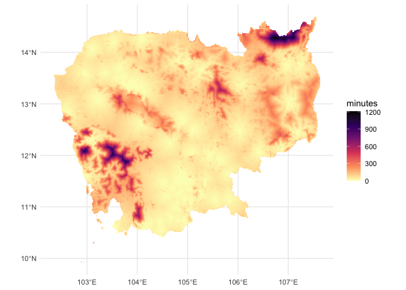
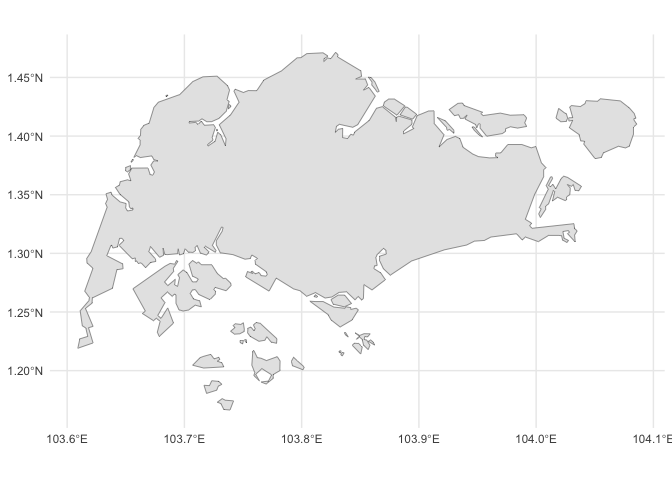
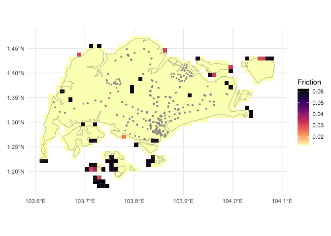
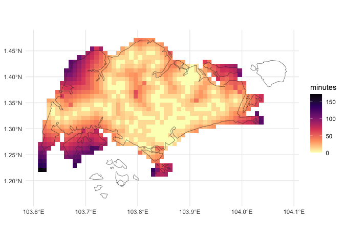

# `traveltime`: an R package to calculate walking and motorised travel
time from user locations
Gerard E Ryan, Nick Tierney, Nick Golding, Daniel Weiss
2025-01-01

# Summary

Understanding and mapping the time to travel among locations is useful
for many activities from urban planning `[@zahavi1974traveltime]` to
public health `[@weiss2020global]` and likely a myriad others we haven’t
thought of. Here we present a software package — `traveltime` — written
in and for the language R `[@Rref]`. `traveltime` enables a user to
supply a set of geographic point locations and an extent of interest,
and calculate the motorised or walking travel time over that extent. The
result is a raster of 30 arcsecond resolution (approximately 0.008333
decimal degrees, or just below 1 km<sup>2</sup> at the equator) where
the value in each cell is the lowest travel time in minutes to any of
the supplied point locations over the extent of interest.

The work-flow requires two steps:

-   downloading a ‘friction surface’ for the area of interest, and then
-   calculating travel time over that surface for the points of
    interest.

`traveltime` provides a spatial interface using object classes from the
`terra` package `[@terra]`. It accepts points as either `data.frame` or
`SpatVector` class objects; extents as `numeric`, `SpatExtent`,
`SpatVector`, or `SpatRaster` objects; and return the results as a
`SpatRaster` object. The package uses `gdistance` `[@gdistance2017]` to
calculate the minimum least-cost-distance for each cell from the points
of interest.The travel time is calculated as movement over a ‘friction
surface’ based-on the surfaces generated by `@weiss2020global` available
via the `malariaAtlas` package `[@pfeffer2018malariaatlas]`. Rather than
house and manipulate these surfaces independently, `traveltime` relies
on `malariaAtlas` to download the surfaces for the extent of interest.

    Start tag expected, '<' not found
    Start tag expected, '<' not found

    <GMLEnvelope>
    ....|-- lowerCorner: 9.9136 102.34
    ....|-- upperCorner: 14.6903 107.6319Start tag expected, '<' not found



Although this article is intended to be the key reference for the
`traveltime` package, any citations of it should also be citing the
underlying work by `@weiss2018global; @weiss2020global`.

# Statement of need

Global maps of travel time to cities `[@weiss2018global]` and health
care facilities `[@weiss2020global]` have generated significant interest
and use. Collectively `@weiss2018global ; @weiss2020global` have over
1300 citations (Google Scholar, at 10th December 2024), and the city
data set is available to R users through the widely-used `geodata`
package `[@geodata]`. There is clear demand for these type of products.

`@weiss2020global` and colleagues made their code available as an R
script to allow for reproduction and extension of their analyses
(<https://malariaatlas.org/wp-content/uploads/2022/11/R_generic_accessibilty_mapping_script_2020-1.txt>
). To further enable extension of this work, here we have developed an R
package based on that code to seamlessly calculate the travel time from
any arbitrary set of locations.

Other R packages produce superficially similar though not identical
functionality. At least three R packages provide interfaces to the
<https://www.TravelTime.com> API
`[@traveltimeapi; @traveltimeR; @rtraveltime; @traveltime_gh]`. The
TravelTime.com platform provides travel time and routes between pairs of
locations, and ‘isochron’ polygons, which are areas reachable within a
given time from a given location. The latter is most comparable to what
the `traveltime` package achieves,

THIS NEXT SENTENCE SUX - EXPLAIN WHY ITS THE SAME AND GIVE A BETTER
EXPLANATION OF THE DIFFERENCE.

however without complete spatial coverage, or distance to the nearest of
a given point. Furthermore, it requires access keys, caps queries, and
uses an external server for calculations, which add friction to the use
experience.

With `traveltime`, we provide internally complete software to estimate
motorised or walking travel time from any number of user-supplied
locations, across a complete area of interest.

# Example workflow: walking in Singapore

In this example workflow, we wish to calculate the walking travel time
to the nearest mass transit station across the island nation of
Singapore — specifically MRT and LRT stations — and create a map of
this.

To do this we will need two items of information: - our are of
interest - in this case, a map of Singapore - the locations of MRT and
LRT stations

We can download a national-level polygon of Singapore from the GADM
`[@gadm]` database using the `geodata` package `[@geodata]`. Here we
download only the national boundary (`level = 0`) and at a low
resolution (`resolution = 2`).

``` r
library(terra)
library(geodata)
library(tidyterra)

sin <- gadm(
  country = "Singapore",
  level = 0,
  path = tempdir(),
  resolution = 2
)

ggplot() +
  geom_spatvector(
    data = sin
  ) +
  # scale_fill_viridis_c(
  #   option = "A",
  #   direction = -1,
  #   na.value = "transparent"
  # ) +
  scale_fill_manual(na.value = "transparent") +
  theme_minimal()
```



The the `stations` data set included in the `traveltime` package is a
563 $\*$ 2 matrix containing the longitude (x) and latitude (y) of all
LRT and MRT station exits in Singapore from `@singdata:2024`.

``` r
library(traveltime)
head(stations)
```

                x        y
    [1,] 103.9091 1.334922
    [2,] 103.9335 1.336555
    [3,] 103.8493 1.297699
    [4,] 103.8508 1.299195
    [5,] 103.9094 1.335311
    [6,] 103.9389 1.344999

So now we have the two items of data we require. The next step is to
download a friction surface for our area of interest.

We can pass in our basemap `sin`, a `SpatVector`, directly as the
`extent`. It would also be possible pass in a `SpatRaster` with extent
equal to our area of interest, or specify coordinates either as a
vector, matrix, or `SpatExtent`.

We’re interested in walking time from a station, so we’ll download the
walking friction surface by specifying `surface = "walk2020"`.
Alternatively, we could use `"motor2020"` for motorised travel if that
was of interest.

We’re also only interested in walking *on land* so we mask out areas
outside of `sin`, that are within the extent of the raster:

``` r
library(traveltime)

friction_singapore <- get_friction_surface(
    surface = "walk2020",
    extent = sin
  )|> 
  mask(sin)
```

    <GMLEnvelope>
    ....|-- lowerCorner: 1.1664 103.6091
    ....|-- upperCorner: 1.4714 104.0858Start tag expected, '<' not found

``` r
friction_singapore
```

    class       : SpatRaster 
    dimensions  : 37, 57, 1  (nrow, ncol, nlyr)
    resolution  : 0.008333333, 0.008333333  (x, y)
    extent      : 103.6083, 104.0833, 1.166667, 1.475  (xmin, xmax, ymin, ymax)
    coord. ref. : lon/lat WGS 84 (EPSG:4326) 
    source(s)   : memory
    varname     : Accessibility__202001_Global_Walking_Only_Friction_Surface_1.1664,103.6091,1.4714,104.0858 
    name        : friction_surface 
    min value   :       0.01200000 
    max value   :       0.06192715 

Taking a look at these data, below we plot the friction surface raster
`friction_singapore`, with the vector boundary of `sin` as a dashed grey
line, and `stations` as grey points. Higher values of friction indicate
more time travelling across a given cell.

``` r
library(tidyterra)
library(ggplot2)

ggplot() +
  geom_spatraster(
    data = friction_singapore
  ) +
  geom_spatvector(
    data = sin,
    fill = "transparent",
    col = "grey50"
  ) +
  geom_point(
    data = stations,
    aes(
      x = x,
      y = y
    ),
    col = "grey60",
    size = 0.5
  ) +
  scale_fill_viridis_c(
    option = "A",
    na.value = "transparent",
    direction = -1
  ) +
  labs(
    fill = "Friction",
    x = element_blank(),
    y = element_blank()
  ) +
  theme_minimal()
```



With all the data collected, the function `calculate_travel_time` takes
the friction surface `friction_singapore` and the locations of interest
`stations` and returns a `SpatRaster` of walking time in minutes to each
cell from the nearest station.

``` r
travel_time_sin <- calculate_travel_time(
  friction_surface = friction_singapore,
  points = stations
)
travel_time_sin
```

    class       : SpatRaster 
    dimensions  : 37, 57, 1  (nrow, ncol, nlyr)
    resolution  : 0.008333333, 0.008333333  (x, y)
    extent      : 103.6083, 104.0833, 1.166667, 1.475  (xmin, xmax, ymin, ymax)
    coord. ref. :  
    source(s)   : memory
    name        : travel_time 
    min value   :           0 
    max value   :         Inf 

Here are those results as in a map:

``` r
ggplot() +
  geom_spatraster(
    data = travel_time_sin
  ) +
  scale_fill_viridis_c(
    option = "A",
    direction = -1,
    na.value = "transparent"
  ) +
  theme_minimal() +
  labs(fill = "minutes") +
  geom_spatvector(
    data = sin,
    fill = "transparent",
    col = "grey20"
  )
```



Note that the above raster include infinite (`Inf`) values. In
<a href="#fig-data" class="quarto-xref">Figure 3</a>, a number of
islands to the south are shown as cells unconnected with the mainland.
These raster cells for these islands appear absent in
<a href="#fig-result" class="quarto-xref">Figure 4</a>. Because they are
not connected, the calculated travel time is infinite, and so these
cells do not appear in the plot
<a href="#fig-result" class="quarto-xref">Figure 4</a>.

# Opportunities for future development

The `traveltime` package is immediately suitable to a range of
applications where travel to custom locations of interest. But we
nonetheless see opportunities to build the package utility into the
future through two mechanisms: capability to distribute more friction
surfaces, and additional methods to handle large spatial extents.

Firstly, `traveltime` currently has access to friction surfaces for
2020, both at 30 arc-second resolution. As landscapes are not dynamic,
it may be useful to incorporate updated versions of these friction
surfaces if and when they are available. Furthermore, although the
resolution of these data is likely to be suitable for larger landscape
foci, higher resolution data may be helpful for more locally focussed
analyses. For instance, although the example here was chosen for it’s
simplicity and low computational demands, a 5 km cell size is a
relatively large area to walk across, and thus actual waking times are
likley to vary significantly within each cell.

At the other end of the scale, the package can require large amounts of
memory for analyses over large landscapes (e.g. one analyses over Africa
required ~ 72 GB RAM). Developing methods to handle large landscapes
with less memory would be helpful to make such analyses accessible to
those without access to larger computing resources.

# Acknowledgements

Ta luv

# References
